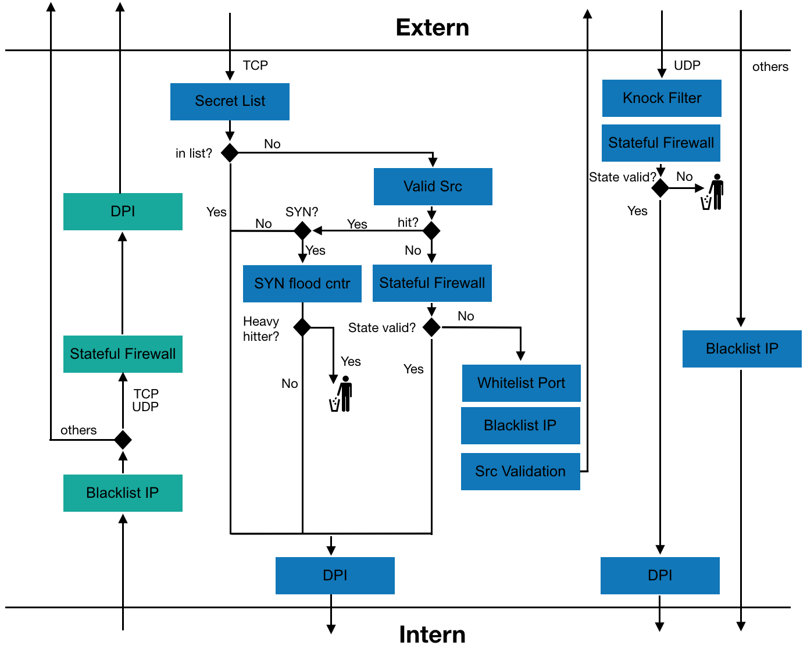

# Advanced Stateful Firewall using P4
**You can read through this section to get information about all features and directly test and investiga them**


This project conceptually shows how parts of a modern firewall can be implemented in hardware by using p4. Firewalls are essential components to provide access control to a network. Today's "next-generation" firewalls provide enhanced protection by combining information from multiple layers. However, such tasks are usually implemented in the control plane and massively degrade the network throughput. By using p4, we implemented a stateful firewall, extended with SYN-flood attack prevention, deep packet inspection, port knocking, and white-/ blacklists. We showed that parts of a firewall controller can be moved to the hardware and could therefore run at the speed of modern switches.

<p align="center">

<p/>

## Getting Started

These instructions will get the network and firewall up and running.

For convenience you can start the `open_terminals.sh` script in the _Project_ folder. This starts several _xterm_ windows. The **mininet is started automatically** in one of the windows!! The script asks you, if you want to start all controllers immediately (wait for until mininet is available) or if it just open a "reasonable (=5)" additional windows.

### Network
The network we provide for testing our firewall looks like the following. The firewall (red) is connected to the "internet" or _external network_ (blue) and an _internal network_ with hosts (green) and a server (yellow).

<p align="center">

<p/>

Being in the _Project_ folder, start mininet on your own with
`sudo p4run`
or use
`./open_terminals.sh`
and answer with **n**!

Next use `pingall` to check for full connectivity. Now we can activate the firewall. (If you chose **y** above, `pingall` does not work as explained in the `Black and White Lists` section).

## Firewall

A step by step description on the individual controller scripts to set up the firewall. We assume that you changed to the corresponding folder when we present the commands, but the scripts should work from anywhere. (`open_terminals.sh` opens some windows in each folder!)
* The controller scripts are in `Project/controller` folder.
* The testing scripts, are in `Project/testing` folder.

### Stateful firewall
The stateful firewall is completely implemented in p4. Therefore it runs since the start of mininet. All IP traffic not being UDP or TCP can pass, as this was not part of our focus. Therefore pingall shows full connectivity (as long as no filters are set). When sending TCP and UDP, all ingress traffic should be blocked due to the stateful firewall being active. See firewall diagram for further informations. If a TCP/UDP packet is sent from inside out, then the response will be allowed back in.

Now lets activate all functionalities of the firewall with our default values.
```
sudo python firewall_controller.py
```

### Black and White Lists
This script sets up the Whitelist for TCP ports and Blacklists for IP adresses.
**NOTE**: To add new ports or IP addresses, use the *.txt* files in *filters* folder and either run the script again (and reset everything), or manually clear the corresponding list and load it again. Check the README of the controller folder for details and examples.

**Test:** Use ping to verify that certain IP's are blocked, use:
```
mininet> he1 ping hi2
```
We block **he1** on the blacklist for ingress and egress traffic.
But **he2** can ping:
```
mininet> he2 ping hi2
```

### Sniff & Heavy-Hitter controller
Now we can start the two other controllers in two separate windows and keep them running.
`heavy_hitter_controller.py` loops and resets the bloom counter for heavy (syn) hitter detection. We see it in action later.
`sniff_controller.py` listens on the cpu_port `8` where the firewall will send clone packets. The controller will then perform some action according to the clone type.
```
sudo python heavy_hitter_controller.py
sudo python sniff_controller.py
```  

### Port knocking
The `firewall_controller` has set the **default values** for port knocking, that are also used for the test example. The defaults are: Knock sequence `100 101 102 103` with a timeout of `5` seconds between each knock. The secret port that opens is determined by the `sniff_controller` where it is hardcoded to `3142`.

The knock sequence gives all different knocking states to the firewall, such that the whole knocking state machine operates in p4. The firewall notifies the controller when someone knocks correctly, who will then set an entry on the **Secret List** to grant entrance trough the secret port.

**Test:** Open two port interfaces on the firewall, one on the internal side, one on the external. In example we send the knock sequence from he2 to hi2.
```
mininet> xterm fir fir
```
In one fir CLI to get the external port of fir towards he2, type:
```
tcpdump -enn -i fir-eth2
```
Then in the other fir CLI, to get internal port of fir towards hi2, type:
```
tcpdump -enn -i fir-eth5
```
Now we are able to inspect all traffic reaching the firewall from he2, and can see what gets trough towards hi2.

To activate the knock tester, go into the Project/testing folder and run:
```
sudo python knock_seq_send.py --local --src he2 --dst hi2 -k 100 101 102 103 -s 3142
```
**HINT**: the `--local` option is needed because we start the script not via a window reached from the `mininet` with `xterm <host>`. The testing scripts can this for us but we have to tell it. _Strange behavior_ can occur if this is not done!!

With [100, 101, 102, 103] being the correct knocking sequence. The secret port is set within the script.
This test file runs 3 test cases:

* Send knock sequence with a timeout-> nothing should get trough firewall.
* Send knock sequence including wrong knock-> nothing should get trough firewall. Then a correct one is send, and 1 tcp packet should be able to pass the firewall on the secret port 3142.
* 3 knockers are trying to complete a correct knock, while the firewall is hammered with many different UDP packets. Each UDP packet creates a knock. When successful, 3 TCP packet from 3 different source ports should get trough the firewall.

### SYN flood defender
The TCP cookie part to validate the source is completely implemented in P4 and works since the start of the switch but it relies on the `sniff_controller` to set the entry for pass through of validated sources.
This controller also takes care of accepted sources that become heavy SYN hitters. The controller will get a notice from the switch, remove these sources from the access list, and blacklists them.

**Test:**
Make sure that the `heavy_hitter_controller` is still running and prints the green 'X's and the `sniff_controller` is still required as well.
We want to inspect some interfaces
```
mininet> xterm he3 fir ser
tcpdump -enn -i he3-eth0
tcpdump -enn -i fir-eth2
tcpdump -enn -i ser-eth0
```

You need three different testing scripts. Execute them in the following order:
1. `sudo python server.py --local --debug` will connect and start on the server `ser` and wait for a first SYN packet to respond to a TCP handshake. For that to be possible a client (here: he3 with IP: 10.0.3.1) has to validate himself first.
2. `sudo python syn_flood.py --local` will connect to **he2** and will loop through the subnet 10.0.3.x of **he3**, hence **he2 is spoofing and syn-flooding** our network. We see this on the interfaces we started on he3 and fir. On `fir` we see the SYNs [S] from all the spoofed addresses and towards `he3` we see the SYNACKs [S.] sent from the firewall to the he3 subnet.
3. `sudo python client.py --local --debug --src he3 -p 5` tries to connect to the server with a TCP handshake. The packets are hard to see in all the noise, but the client script will print what it sees.
First, it will send a SYN and get a SYNACK from the firwall. It replies with an ACK, but the firewall responds with a RST to indicate it has to try again. In the mean time, we see that the `sniff_controller` received a cloned packet and sets 10.0.3.1 for dst 10.0.4.4 (=ser) on the _source accepted_ table.
Second, another handshake is started by the client which will now reach the server, the server completes the handshake and the client will send 5 data packets that are printed by the server. After a while the server will timeout and stop.
_Note_, that we now see an occasional spoofed packet by the syn-flooder because it sends a valid combination: 10.0.3.1 with TCP-dport 80.
4. Now we want to test the revocation of the source validation. Restart the server in the **bad** mode, which still completes a handshake, but then only listens and prints any SYN packet it receives.
`sudo python server.py --local --debug --bad`
Start the client in its **bad** mode, where it performs a handshake again, but once it is successful, it will only send SYN packets.
`sudo python client.py --local --debug --src he3 --bad -p 100`
**Note!!**, that you might _have restart_ the scripts because the syn-flooder starts the handshake with the server before the client does and the server sends a SYNACK the client does not expect. **Therefore, you probably should stop the syn-flooder for this part!!!** (because the testing scripts are not super robust...)
We see that some SYN packets get through to the server (interface and script) but the firewall detects it and informs the `sniff_controller` to remove the valid entry and blacklist this client.
5. If you like, you can now retry step 3 **WITHOUT success**, because 10.0.3.1 is blacklisted now and cannot verify itself anymore with a full handshake.

## Some Cleanup
[**Note**: If you want to skip this, just stop the mininet and close all winows. Restart with `Project/open_terminals.sh` and answer **y** this time, which restarts everything.]

Let's clean some stuff up to demonstrate some things of the `firewall_controller` and get a more manageable amount of windows.
- Stop the `heavy_hitter_controller` and close the window.
- Close the interface windows from the syn flood tests.
- Stop 'syn_flood.py' and close the window if you have not already.
- Terminate `server.py` if it is still listening to SYNs.

Now, you should have something like two testing windows, the miniet and the `sniff_controller` running. Get yourself also a window in the `Project/controller` folder, where we first perform some `firewall_controller` commands.
**ATTENTION**: If you run the script without any arguments, the default actions will run again, what we do not want for this demonstration.

- Clean the blacklist (removing malicious _he3_ from the syn-flood test) and reset to the default values from the file "Project/filters/ext2in_blacklist_srcIP.txt" which blacklists _he1_ and our internal addresses as these should not get to us from the outside:
`sudo python firewall_controller.py -fc bs -fs bs`
- Remove the successful knockers from the port knocking tests:
`sudo python firewall_controller.py -tc knock`
- Deactivate DPI
`sudo python firewall_controller.py --no_dpi`

Continue with the next section: DPI
## Deep Packet inspection
##### Preparations
The firewall choses some _internally_ started flows to inspect further by sending the whole packets to the `sniff_controller` who logs the flows in files. Let's activate dpi with probability of 100% to inspect every (internal) flow.
`sudo python firewall_controller.py -dp 100`

Verify that there is the folder `controller/dpi_log` and change to it `cd controller/dpi_log`. If it is not, restart the `sniff_controller` which will create it. Remove all the files in the folder if there were any present to make the next points in the tests below clearer.

In separate testing windows _prepare_ the following commands:
A) `sudo python send.py --local --src hi2 --dst he2 --i2e` Note, the important _i2e_ option (depending on this the script sets the sport and dport, also required for the flow id)!
B) `sudo python send.py --local --src he2 --dst hi2`

##### Tests
We simulate traffic between these two **hi2** and **he2** by hand.
- Execute **A** and check that the sniff controller sees the DPI clone.
List the files in the `dpi_log` folder.
`cat` the file and check the contents.
This single packet should be visible with a little payload.
- The above probably took you long enough such that flow timed out at the firewall :).
Execute **B**. No packet is logged, because the firewall thinks a new flow wants to be established from the outside (what our "statefulness" does not appreciate).
[If you were fast enough, the behavior of the next step should be visible.]
- Execute **A** again and **B** shortly after.
Now both packets get sent to the controller, because 'A' starts a new flow, which then is also recognized in the other direction.
This is also visible in the second file that got created, that now contains two packets.
- The same thing can be done with _UDP_.
For example extend both commands with `--udp -p 100` and execute them shortly after another (extended A first).
Run `ll` in the `dpi_log` folder and notice that the udp file is much larger and the flow id in the filename is different, because we differentiate TCP and UDP flows.
- Lower the probability for inspection with `sudo python ../firewall_controller.py -dp 20`.
Optionally remove all the dpi logs `rm dpi*`.
Execute `sudo python send.py --local --i2e --dst he3 --src hi1` several times and always change the last number of the src hiX through 1 to 3 and sometimes add --udp if you want.
You should notice that only some flows will be started to be inspected and some are not because we lowered the probability.
This can be seen in the `sniff_controller` output and the fewer files generated in the `dpi_log` folder.

## Finish
These were all tests that show the functionalities of our firewall in `p4`. For even more details head over to `controller/README` and `testing/README` to get more descriptions of what all the scripts can do.

## Authors

* **Manuel Pulfer**
* **Philipp Friedli**
* **Matthias Staehli**
