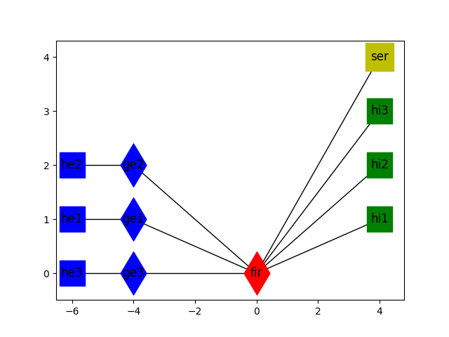

# Advanced Stateful Firewall using P4

This project conceptually shows how parts of a modern firewall can be implemented in hardware by using p4. Firewalls are essential components to provide access control to a network. Today's "next-generation" firewalls provide enhanced protection by combining information from multiple layers. However, such tasks are usually implemented in the control plane and massively degrade the network throughput. By using p4, we implemented a stateful firewall, extended with SYN-flood attack prevention, deep packet inspection, port knocking, and white-/ blacklists. We showed that parts of a firewall controller can be moved to the hardware and could therefore run at the speed of modern switches.

<p align="center">

<p/>

## Getting Started

These instructions will get the network and firewall up and running.

### Network
The network we provide for testing our firewall looks the following:

<p align="center">

<p/>

Being in the Project folder, we can use the following command to start mininet

```
sudo p4run
```
Next use `pingall` to check for full connectivity. Now we can activate the firewall.

## Firewall

A step by step description on the individual controller scripts to set up the firewall.
* To start the controller scripts, one should be in Project/controller folder.
* To start the testing scripts**, one should be in Project/testing folder.


### Stateful firewall
The stateful firewall is completely implemented in p4. Therefore it runs since the start of mininet. All IP traffic not being UDP or TCP can pass, as this was not part of our focus. Therefore pingall shows full connectivity. When sending TCP and UDP, all ingress traffic should be blocked due to the stateful firewall being active. See firewall diagram for further informations. If a TCP/UDP packet is send from inside out, then the response will be allowed back in.

### Black and White Lists
This script sets up the Whitelist for TCP ports and Blacklists for IP adresses.
To add new ports or IP addresses, use the *.txt* files in *filters* folder and restart controller.

Set up black and white lists, type into CLI:
```
sudo python firewall_controller.py
```
**Test:** Use ping to verify that certain IP's are blocked, use:
```
mininet> he1 ping hi2
```
We block he1 on the blacklist for ingress and egress traffic.

### Port knocking
To enable port knocking, the controller script needs to be started by:

```
sudo python port_knock_controller.py
```
or
```
sudo port_knock_controller.py -ps 100 101 102 103 -s 3143 -t 5000000
```
This command sets the defaults used for the test example.
This script sets tells the firewall all different knocking states, such that the whole knocking state machine operates in p4.
This script should be kept open during the knocking, because it will receive messages from the switch/firewall. These messages contain information for the switch to set an entry on the **Secret List** to grant entrance trough the secret port.
To set a specific secret port, knocking sequence, max time between knocks, use:
```
sudo port_knock_controller.py -ps <knock sequence> -s <secret port> -t <max time between knocks>
```
**Test:** Open two port interfaces on the firewall, one on the internal side, one on the external. In example we send the knock sequence from he2 to hi2.
```
mininet> xterm fir fir
```
In one fir CLI to get the external port of fir towards he2, type:
```
tcpdump -enn -i fir-eth2
```
Then in the other fir CLI, to get internal port of fir towards hi2, type:
```
tcpdump -enn -i fir-eth5
```
Now we are able to inspect all traffic reaching the firewall from he2, and can see what gets trough towards hi2.

To activate the knock tester, go into the Project/testing folder and run:
```
sudo python knock_seq_send.py --local --src he2 --dst hi2 -k 100 101 102 103 -s 3142
sudo python knock_seq_send.py --local --src <srcName> --dst <dstName> -k <knock sequence> -s <secret port>
```
With [100, 101, 102, 103] being the correct knocking sequence. The secret port is set within the script.
This test file runs 3 test cases:

* Send knock sequence with a timeout-> nothing should get trough firewall.
* Send knock sequence including wrong knock-> nothing should get trough firewall. Then a correct one is send, and 1 tcp packet should be able to pass the firewall on the secret port 3141.
* 3 knockers are trying to complete a correct knock, while the firewall is hammered with many different UDP packets. Each UDP packet creates a knock. When successful, 3 TCP packet from 3 different source ports should get trough the firewall.

### SYN flood defender
The TCP cookie part to validate the source is completely implemented in P4 and works since the start of the switch. To grant access for validated source, the syndef_controller is setup.
```
sudo python syndef_controller.py
```
This controller also takes care of accepted sources that become heavy SYN hitters. The controller will get a notice from the switch, remove these sources from the access list, and blacklists them.

**Test:**


##Deep Packet inspection


## Authors

* **Manuel Pulfer**
* **Philipp Friedli**
* **Matthias Staehli**
